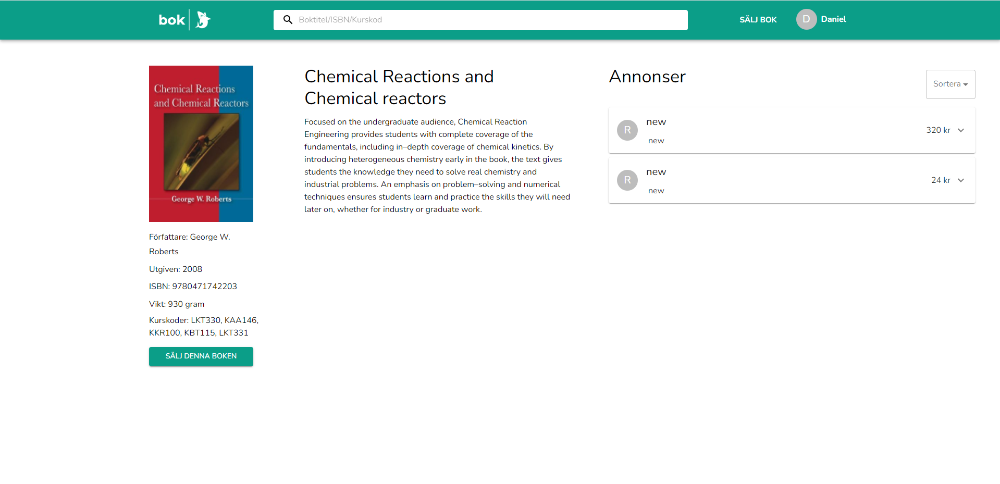

# dat257-xzibit

 

## Introduction

This is a project for course dat257, created by group: Xzibit. This app is a website created for selling old course literature to other students. This project is not intended to be published.

## Project Status

This is now in it's startup phase were we are actively implementing all of it's core features.

### features

Not Started:
Work in Progress:
Done:

- Login / Logout :white_check_mark:
- Publish ads :white_check_mark:
- Search for books :white_check_mark:
- See corresponding ads to that book :white_check_mark:
- Edit your own ads :white_check_mark:

## Screen Shots

#### Home

#### Book Detailed View

#### SellingPage

#### Search

#### BookAds

## File Structure

- app - This is the main react application for the website
- cremona - API handling books
- docs - Documentation from group members throughout the course

## External data and APIs

To store users we are using Firebase Authentication API and extending upon that using Firebase Firestore to store additional user data. For fetching books from Chalmers Store Library we are using Cremona. We are also using Firestore for handling book ads.

## Installation and Setup Instructions

OBS! In order to start the application you need to be inside /app directory in the repository.

Installation:
`npm install`

Test:
`npm test`

To Start Server:
`npm start`

To Visit App:
`localhost:3000`

## Group Members

<b>Daniel Rygaard</b>  
Github: https://github.com/Danryg  
<b>Pouya Shirin</b>  
Github: https://github.com/Kexon  
<b>Emil Svensson</b>  
Github: https://github.com/emilsvennesson  
<b>Elias Falk</b>  
Github: https://github.com/EliasFalk  
<b>Albin Sundström</b>  
Github: https://github.com/sundstromalbin  
<b>Hampus Edeland</b>  
Github: https://github.com/hampusedeland  
<b>Johan Blickhammar</b>  
Github: https://github.com/JohanBlickhammar  
<b>To Le</b>  
Github: https://github.com/tole97  

## Links

Scrum board: https://trello.com/b/S5gYZGke/scrumboard
